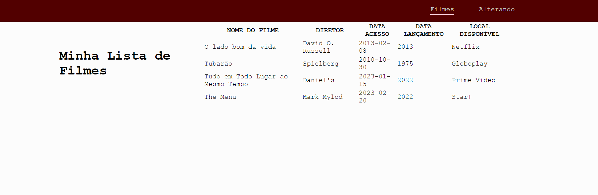

# Movies list API - MVP
Creating and movie list app for Resilia Bootcamp.

First - Create an API for the movie list project
 <br>
Second - Front end table to show the data.

(Pt-br)
Criando um app de lista de filmes para o projeto do case 1 individual para o bootcamp da Resilia. 

 Parte 1 - Criando uma API para o projeto de uma lista de filmes. Realizei todo o back end no padrão MVC e utilizei o banco de dados sqlite. 
 <br>
 Parte 2 - Criei o front para demonstrar em tabela meu banco de dados. 

 
 ## Goal / Objetivo 📍
⇨ Use pattern MVC / Utilizar o padrão MVC;
⇨ Use verbs HTTP and REST / Utilizar os verbos HTTP seguindo o padrão REST;
⇨ Implement all Crud operations / Implementar todas as operações de CRUD;
⇨ Use design pattern DAO / Utilizar o padrão de projeto (design pattern) DAO para abstração de transações no banco, com Promises;

 
 ## Steps / Etapas :bookmark_tabs:
 1. Understand the problem / Entendendo o problema
 2. Model the db / Modelando o Banco   
 5. Understand the API / Entendendo a API
 6. Create the API / Criando a API
 7. Integrate with front end / Integrando ao Front End

 ## Technologies / Tecnologias 🌐
 
 SQLite, Sequelize, Express, Axios, React, Bootstrap
 
 ## How to Use / Guia de Uso :hammer:
 
◼ Install the dependencies / Como instalar as dependências do projeto e Como executar o projeto:

```bash
git clone https://github.com/barbmariana/Cinema_MVP_Case1_Individual
npm install
npm start
```
<br>

◼ Install front end / Como instalar as dependências do front end e Como executar o projeto: 
```bash
git clone https://github.com/barbmariana/Cinema_MVP_Case1_Individual
cd src
cd views
cd listaFilmesApp
cd src
npm i
npm run dev
```


